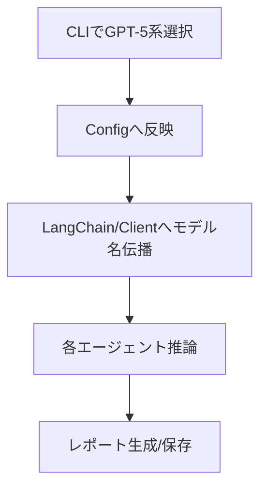

# REQ-2025-0001: GPT-5 系列対応（gpt-5 / gpt-5-mini / gpt-5-nano）

## 1. 要件定義（REQUIREMENT_GATHER_SINGLE）
【入力データ】
- 要望ID: REQ-2025-0001
- タイトル: GPT-5 系列対応
- 概要: OpenAI の GPT-5 系列（gpt-5 / gpt-5-mini / gpt-5-nano）をCLIの選択肢に追加し、既存フローで安定動作させる。

【静的解析による影響箇所（推定）】
- 画面/CLI: cli/utils.py（モデル選択肢）, cli/main.py（説明表示）
- クラス/メソッド: tradingagents/graph/trading_graph.py（モデル名伝播）, tradingagents/default_config.py（既定モデル可変化）, tradingagents/dataflows/interface.py（OpenAI互換確認）
- DB: なし

【要件ジャッジ】
- やるべきか？: Yes
- 優先度: 高
- 影響範囲メモ: モデル選択肢とモデル名受け渡し
- 判断理由/追加ヒアリング事項: 既存OpenAI互換のため実装リスク低。コスト上限/既定モデルの希望有無を確認。

## 2. 詳細設計  方針作成（DETAIL_POLICY）
- 変更対象ファイル・関数（ファイル / 関数名 / 変更概要）
  - `cli/utils.py` / `get_llm_provider_and_models`
    - OpenAI のモデル候補に以下を追加（表示名と実モデル名）
      - Quick/Deep: `gpt-5`（高精度）, `gpt-5-mini`（バランス）, `gpt-5-nano`（低コスト）
    - モデル説明の短文を付与（性能/コストの目安）
  - `tradingagents/default_config.py` / 定数辞書
    - 既定値は現状維持（互換優先）。利用者が CLI で GPT-5 系を選べばそのまま反映されることを明記
    - 備考コメント: GPT-5 系を使う場合は `backend_url = https://api.openai.com/v1` を継続利用
  - `tradingagents/graph/trading_graph.py` / `TradingAgentsGraph.__init__`
    - 渡された `deep_think_llm` / `quick_think_llm` をそのまま `ChatOpenAI(model=...)` に供給（現状動作を確認、コード変更なし）
  - `tradingagents/dataflows/interface.py` / OpenAI クライアント生成部
    - `OpenAI(base_url=config["backend_url"])` のまま利用（変更なし）。モデル名は上位設定から受け取る

- データ設計方針
  - DB 変更なし
  - 設定ファイルに追加項目は不要（既存キーで運用）。将来的に `supported_models` を導入する場合は別要件で実施

- 画面設計方針（CLI）
  - OpenAI 選択時のモデル候補に `gpt-5` / `gpt-5-mini` / `gpt-5-nano` を追加
  - 簡潔な説明（精度/コスト/速度の目安）を併記

- ヒアリング依頼（不足時）
  - 既定モデルの希望（Quick/Deep 各1）
  - 1ジョブ当たりのコスト上限 / 最大トークン上限

## 3. レビュー＆ブラッシュアップ（REVIEW_PACKET）
- 処理フロー（mermaid）

- 開発工数見積
  - 実装 0.5d / テスト・調整 0.5d = 合計 1.0 人日
- 段階的アップデート方針
  - 1) 候補追加 → 2) 既定設定の是非確認 → 3) 動作確認 → 4) 回帰
- 未確定事項（要確認）
  - 既定モデル / コスト上限

- 受け入れ基準（Acceptance Criteria）
  - CLI の OpenAI モデル候補に GPT-5 / GPT-5-mini / GPT-5-nano が表示され選択可能
  - 選択したモデルが `trading_graph` 内の LLM に正しく反映され推論が完了する
  - OpenAI API で 4xx/5xx が出ない（APIキーが正しい前提）
  - 既存モデル選択時の挙動に回帰不具合がない

## 4. ドキュメントアウトプット（FINAL_DOC）
- 要件ジャッジ: Yes / 高
- 変更対象一覧: 上記
- リスク/対応: 互換APIで低リスク、ロールバックはブランチで担保
