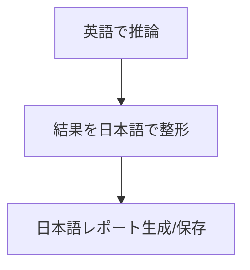

# REQ-2025-0002: 出力の日本語化（推論は英語）

## 1. 要件定義（REQUIREMENT_GATHER_SINGLE）
【入力データ】
- 要望ID: REQ-2025-0002
- タイトル: 出力の日本語化（推論は英語）
- 概要: すべてのエージェント/レポート出力を日本語に統一しつつ、推論は英語で実施。

【静的解析による影響箇所（推定）】
- 画面/CLI: cli/main.py（説明表示）
- クラス/メソッド: agents配下の各プロンプト（analysts/researchers/managers/trader）, graph/trading_graph.py（システムメッセージ統一）, default_config（言語ポリシー）
- DB: なし

【要件ジャッジ】
- やるべきか？: Yes
- 優先度: 高
- 影響範囲メモ: プロンプトのシステムメッセージ/出力整形
- 判断理由/追加ヒアリング事項: 日本語出力の一貫性向上。文体（です/ます）と用語統一、最大トークン/要約粒度の確認。

## 2. 詳細設計  方針作成（DETAIL_POLICY）
- 変更対象ファイル・関数（ファイル / 関数名 / 変更概要）
  - `tradingagents/agents/analysts/*.py` / 各 `system_prompt` またはプロンプト生成箇所
    - 「Reason in English, respond in Japanese.（英語で推論し日本語で回答）」を明記
  - `tradingagents/agents/researchers/*.py` / 同上
  - `tradingagents/agents/managers/*.py` / 同上（リスク/投資判断の出力を日本語に統一）
  - `tradingagents/agents/trader/trader.py` / 同上
  - `tradingagents/graph/trading_graph.py` / システムメッセージ共通方針のコメント追記（実装は各エージェント側）
  - `tradingagents/default_config.py` / 設定
    - `reasoning_lang = "en"`, `output_lang = "ja"` を追加（将来の参照用）
  - レポート生成部（保存処理）
    - 見出しや注記の日本語統一（テンプレは維持）

- データ設計方針
  - DB 変更なし
  - 設定項目追加に留め、参照は段階的に展開

- 画面設計方針（CLI）
  - 説明文に「推論は英語、出力は日本語」を明記

- ヒアリング依頼（不足時）
  - 文体（敬体/常体）、用語集（英→日訳の優先形）、長文時の要約粒度（見出し/箇条書き）

## 3. レビュー＆ブラッシュアップ（REVIEW_PACKET）
- 処理フロー（mermaid）

- 開発工数見積
  - 実装 0.5d / テスト・調整 0.5d = 合計 1.0 人日
- 段階的アップデート方針
  - 1) システムメッセージ追加 → 2) 出力整形確認 → 3) 回帰
- 未確定事項（要確認）
  - 文体/用語/要約粒度

- 受け入れ基準（Acceptance Criteria）
  - エージェント出力が日本語で統一されている（例: 調査レポート、最終判断）
  - 既存の英語混在箇所が残らない（テンプレやヘッダー含む）
  - 推論（内部プロンプト）は英語のまま維持

## 4. ドキュメントアウトプット（FINAL_DOC）
- 要件ジャッジ: Yes / 高
- 変更対象一覧: 上記
- リスク/対応: 長文でのトークン超過段落要約で回避
